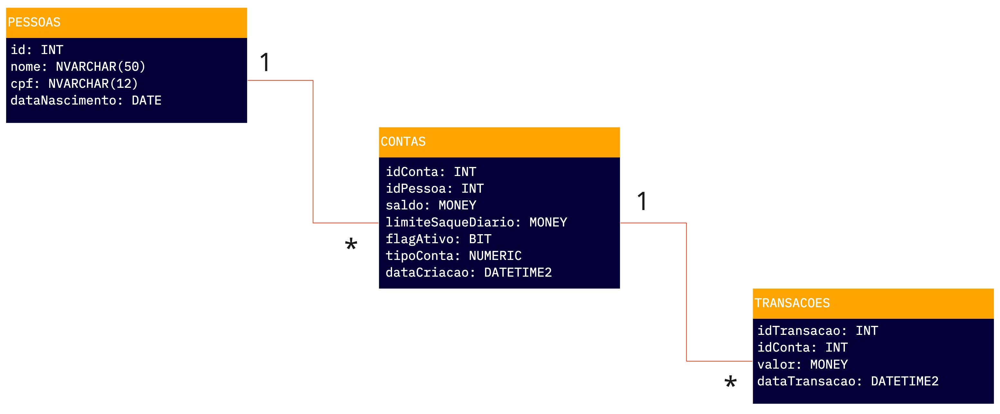
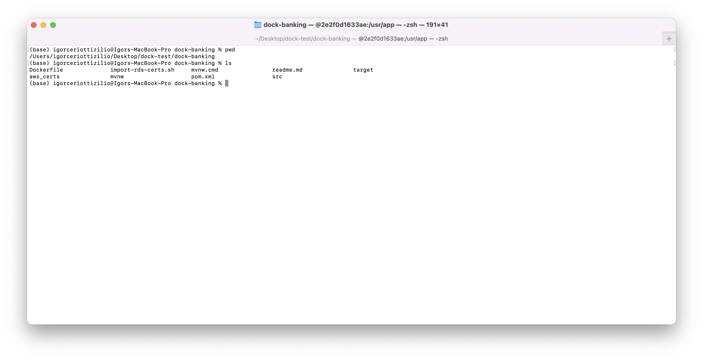
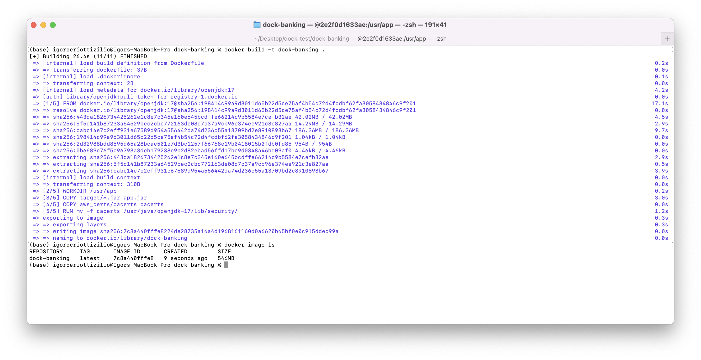
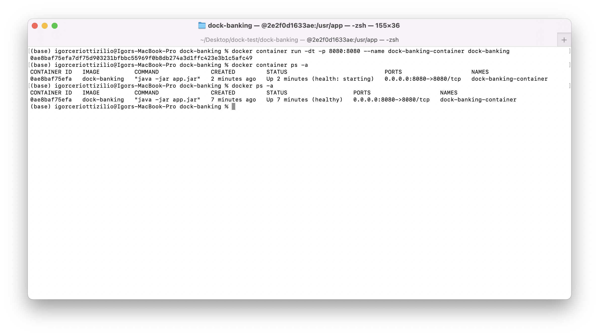
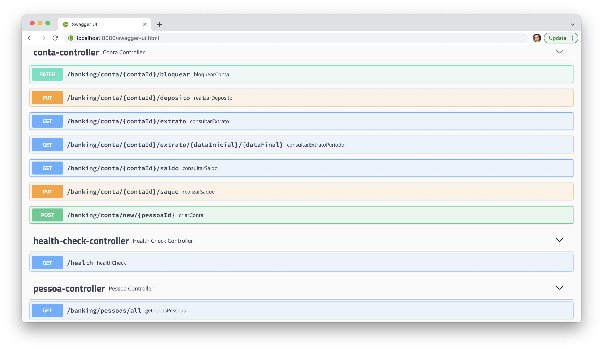
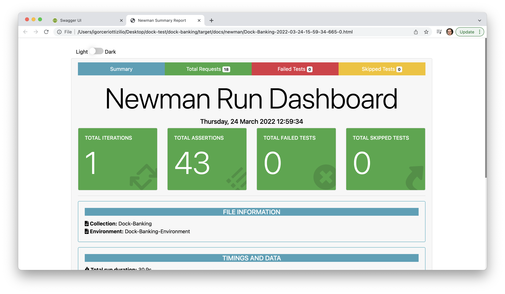

# Desenvolvimento

* O desenvolvimento foi realizado em um MacBook Pro (M1, macOS Monterey)
* JDK 17
* Maven
* Spring Boot

# Banco de dados
### Modelagem



### Tecnologia

* AWS RDBS SQL Server Express Edition
  * Instância db.td3.small, 50GB de storage
  * US-East North Virginia

### Tabelas

* Pela falta de compatibilidade do SQL Server com Apple Silicon, foi utilizado Azure Data Studio para os scripts

#### Pessoas

Já foi adicionada uma entrada. Como o servidor está em nuvem, não é necessário scripts adicionais.

```
IF OBJECT_ID('dbo.Pessoas', 'U') IS NOT NULL
DROP TABLE dbo.Pessoas;
GO

CREATE TABLE dbo.Pessoas
(
id int NOT NULL PRIMARY KEY,
nome nvarchar(50) NOT NULL,
cpf nvarchar(12) NOT NULL,
nascimento date NOT NULL
);
GO

INSERT INTO [dbo].[Pessoas]
( -- Columns to insert data into
[id], [nome], [cpf], [nascimento]
)
VALUES
( -- First row: values for the columns in the list above
1, 'Igor Ceriotti Zilio', '00910012345', '19930125'
)
GO
```

#### Conta

```
IF OBJECT_ID('[dbo].[Conta]', 'U') IS NOT NULL
DROP TABLE [dbo].[Conta]
GO

CREATE TABLE [dbo].[Conta]
(
[idConta] INT IDENTITY(1,1) PRIMARY KEY NOT NULL, 
[idPessoa] INT NOT NULL,
[saldo] MONEY NOT NULL,
[limiteSaqueDiario] MONEY NOT NULL,
[flagAtivo] BIT NOT NULL,
[tipoConta] INT NOT NULL,
[dataCriacao] DATETIME2 NOT NULL
);
GO

ALTER TABLE Conta
ADD FOREIGN KEY (idPessoa)
REFERENCES Pessoas(id)

GO
```

#### Transacao

```
IF OBJECT_ID('[dbo].[Transacao]', 'U') IS NOT NULL
DROP TABLE [dbo].[Transacao]
GO
-- Create the table in the specified schema
CREATE TABLE [dbo].[Transacao]
(
[idTransacao] INT IDENTITY(1,1) PRIMARY KEY NOT NULL, 
[idConta] INT NOT NULL,
[valor] MONEY NOT NULL,
[dataTransacao] DATETIME2 NOT NULL
);
GO

ALTER TABLE Transacao
ADD FOREIGN KEY (idConta)
REFERENCES Conta(idConta)

GO
```
As tabelas do banco de dados estão populadas com algumas informações que foram sendo incluídas durante testes. 

# Como rodar localmente?

Utilize **`Docker`** para evitar conflitos de ambiente. 

**Ponto de atenção**: é necessário que o arquivo _cacerts_ no JDK security contenha os certificados da AWS para ser possível
conectar ao banco de dados. Essa instrução foi incluída no Dockerfile.


O script _import-rds-certs.sh_ realiza essa operação localmente, mas é necessário alterar a variável
CACERTS_FILE para a localização local.

Se não possui o Docker insalado localmente, [instale conforme documentação](https://docs.docker.com/desktop/)

### Passo a passo

#### Crie a imagem do projeto

* Abra o terminal e navegue até a pasta raíz do projeto (mesmo nível que contenha o Dockerfile)



* Rode o comando:
  * `docker build -t dock-banking .`


* Aguarde o download e rode o comando abaixo para checar que a imagem foi construída com sucesso
  * `docker image ls`



#### Subir o container

* Rode o comando
  * `docker container run -dt -p 8080:8080 --name dock-banking-container dock-banking`
* Será gerado um id da instância criada 
* Verifique que o container está ativo rodando 
  * `docker container ps -a`
  * Espera-se que o status esteja como UP
  * Inicialmente _health_ ficará como **_starting_**
  * Foi definido no Dockerfile que seja executada operação de saúde a cada 5 min
  * Após 5 min, espera-se que o status esteja como _**healthy**_

* **A aplicação agora está disponível e exposta em** `localhost:8080`



### Swagger
Agora você pode acessar o Swagger em `http://localhost:8080/swagger-ui.html`



### Collection
Foi gerada collection e environment com os endpoints para o Postman. Também foram adicionados alguns testes funcionais.

[Acesse a collection](target/docs/Dock-Banking.json) em `target/docs/Dock-Banking.json`

[Acesse o environment](target/docs/Dock-Banking-Environment.json) em `target/docs/Dock-Banking-Environment.json`

Foi executada utilizando [Newman](https://www.npmjs.com/package/newman) 
`newman run Dock-Banking.json -e Dock-Banking-Environment.json -r cli,htmlextra`

O [relatório](https://www.npmjs.com/package/newman-reporter-htmlextra) gerado pode ser acessado em 
`target/docs/newman/rodada1.html`



### Javadoc
Foi gerado Javadoc

[Acesse aqui](target/dock-banking-1.0-javadoc/index-all.html) ou em `target/dock-banking-1.0-javadoc/index-all.html`

### Após concluir avaliação

* Destrua o container 
  * `docker container kill dock-banking-container`
  * `docker rm dock-banking-container`
* Remova a imagem
  * `docker image rm dock-banking`